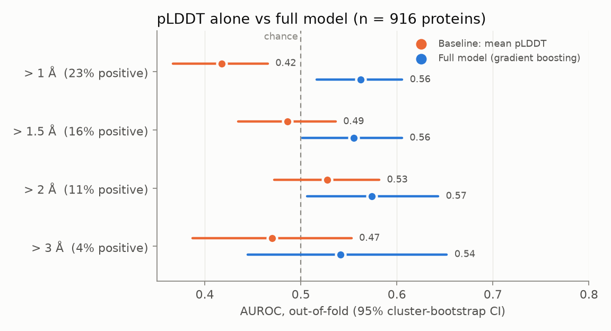
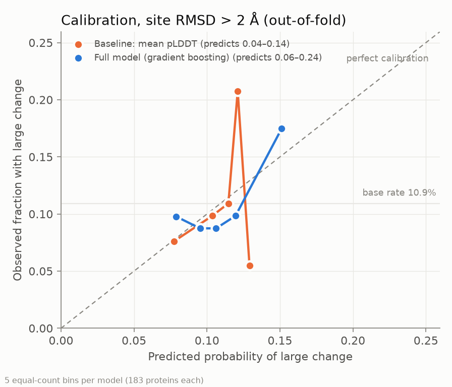
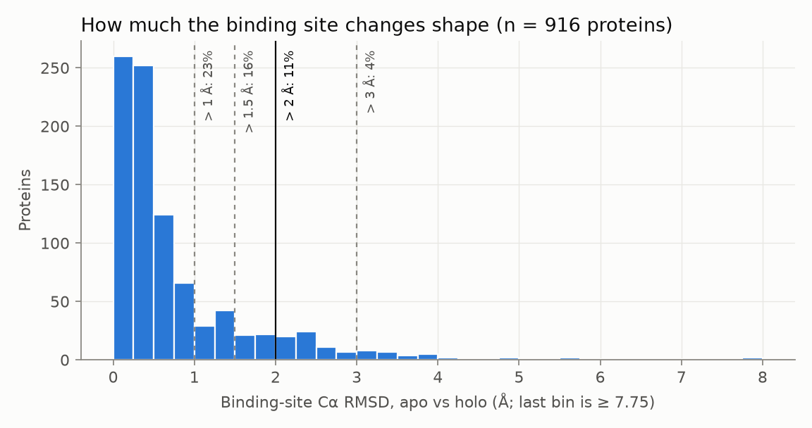

# flexflag

**Can you tell, before docking, whether a protein's binding site will change shape?**
Across 933 proteins that the PDB has solved both empty (apo) and ligand-bound (holo),
**11% have binding sites that move more than 2 Å** between the two states. AlphaFold's
own confidence score, pLDDT, **does not predict which ones** (AUROC 0.52, CI spanning
chance). A small model on free AlphaFold DB and sequence features does better, but only
modestly (AUROC 0.59).

> **Status: v0.1, in active development.** The dataset, labels, cluster-aware
> evaluation and the baseline comparison are done and reproducible. The
> `flexflag check <UniProt>` CLI is **not built yet** (see [Status](#status)).



## Why this matters

Docking screens molecules against one protein structure, usually an AlphaFold
prediction. But proteins flex, and pockets can reshape when a ligand binds. pLDDT
measures how confident AlphaFold is in the shape it returned. It says nothing about
whether the protein has *other* shapes. Methods that sample alternative conformations
exist (MD, AlphaFold2-RAVE, MSA subsampling) but are expensive. flexflag asks a cheaper
question that comes *before* those methods: **is this target likely to change shape at
the binding site?** It flags risk. It does not predict the alternative conformation.

## Results

All numbers come from `python scripts/02_train_eval.py`. n = 933 proteins in **680
sequence clusters** (MMseqs2, 30% identity). Evaluation uses 5-fold cross-validation
where every cluster sits entirely in one fold (asserted in code), and 95% CIs come from
1,000 bootstrap resamples **of clusters**, not of proteins.

### The comparison that defines this repo: pLDDT alone vs the full model

Label: binding-site Cα RMSD > 2 Å (102 positives, 10.9% base rate).

| Model | AUROC | AUPRC | ECE | Brier |
|---|---|---|---|---|
| Baseline: mean pLDDT | 0.521 [0.461, 0.578] | 0.108 [0.085, 0.139] | 0.005 | 0.097 |
| Baseline: fraction pLDDT < 70 | 0.551 [0.492, 0.611] | 0.126 [0.097, 0.172] | 0.004 | 0.097 |
| Logistic regression, all features | 0.618 [0.564, 0.673] | 0.145 [0.114, 0.190] | 0.020 | 0.098 |
| **Full model** (gradient boosting, calibrated) | **0.592** [0.529, 0.655] | **0.169** [0.123, 0.250] | 0.005 | 0.096 |

Full model minus mean-pLDDT baseline (paired cluster bootstrap): **AUROC +0.073
[+0.002, +0.142], AUPRC +0.067 [+0.020, +0.133].**

**What this says, plainly:**

1. **pLDDT is not a binding-site flexibility signal.** Mean pLDDT scores at chance at
   every threshold tested. A high-confidence AlphaFold model is no less likely to have a
   pocket that reshapes on binding. If anything, the effect runs slightly the other
   way: proteins with fewer low-confidence residues move a little *more* (see
   [findings](docs/findings.md)).
2. **The full model beats pLDDT, but the gain is modest.** Its lower CI bound at 2 Å is
   barely above zero. In practice: proteins in the model's **top fifth change shape
   16.6% of the time vs 8.0% in its bottom fifth**, about 2× enrichment. For pLDDT, the
   same split gives 9.6% vs 7.0%.
3. **This is not yet a useful standalone flag.** Out-of-fold predictions only span
   5–26%, and the Brier score (0.096) is barely below always guessing the base rate
   (0.097). The low calibration error (ECE 0.005) is real but cheap: a model that stays
   close to the base rate is easy to calibrate. There is no confident "high-risk" band
   yet.
4. **The PAE "hinge" features, expected to help most, did not.** Most of the signal
   comes from sequence composition (cysteine, polar and hydrophobic fractions). That
   likely reflects protein *class*, e.g. disulfide-rich secreted enzymes are rigid,
   rather than a flexibility mechanism. See [findings](docs/findings.md).

A plain logistic regression on the same features matches the boosted model (better
AUROC, worse AUPRC, overlapping CIs). So the gain comes from the features, not from
model complexity.

### Sensitivity to the "large change" threshold



| Threshold | Positives | Mean pLDDT AUROC | Full model AUROC | Full − pLDDT (95% CI) |
|---|---|---|---|---|
| > 1 Å | 218 (23.4%) | 0.461 | 0.567 | +0.106 [+0.042, +0.170] |
| > 1.5 Å | 145 (15.5%) | 0.467 | 0.580 | +0.113 [+0.049, +0.173] |
| **> 2 Å** | 102 (10.9%) | 0.521 | 0.592 | +0.073 [+0.002, +0.142] |
| > 3 Å | 38 (4.1%) | 0.498 | 0.612 | +0.114 [+0.012, +0.221] |

The qualitative result holds at every threshold: pLDDT is near chance, and the model is
modestly but consistently better. Full tables with CIs for every metric are in
[`results/metrics.md`](results/metrics.md).



## How the label is defined

For each apo–holo pair (`flexflag/labels.py`):

1. Take the first model, drop hydrogens and waters, and keep the first altloc.
2. **Ligand:** the non-polymer, non-additive residue (≥ 6 heavy atoms) with the most
   heavy atoms within 5 Å of the holo protein chain. Buffers, glycans and ions are
   excluded. Peptide ligands are out of scope.
3. **Binding site:** holo-chain residues with any heavy atom within **5 Å** of the
   ligand.
4. Match holo and apo residues by global sequence alignment, keeping identical residues
   only. This handles different numbering and chain IDs (tested).
5. **Label:** Cα RMSD of the site after Kabsch superposition **on the site itself**.
   This measures how much the pocket deforms, not how far it moves with the rest of the
   protein.
6. Large change = site RMSD > 2 Å. Results at 1, 1.5 and 3 Å are shown above.

Checks: adenylate kinase (lid closes over Ap5A) scores 6.1 Å and trypsin + benzamidine
scores 0.16 Å (both in `tests/`). Our binding sites fall 96–100% inside APObind's own
site lists, so we pick the same pocket ([data-choice.md](docs/data-choice.md)).

## Data

- **Pairs:** [APObind](https://github.com/devalab/Apobind) (apo partners for PDBbind
  v2019 complexes). Only the pair identifiers are used. Every structure is re-fetched
  from RCSB, and residues are mapped to UniProt with SIFTS.
- **One pair per protein:** APObind's 12,267 pairs cover only ~1,200 proteins (one empty
  protease can pair with dozens of complexes). Features are per protein, so we keep the
  best-matched pair per UniProt accession. Otherwise heavily-studied proteins would
  dominate the results.
- **Filters:** 12,267 pairs → 7,687 after quality filters (APObind TM-score ≥ 0.5,
  sequence identity and coverage ≥ 0.9, crystal apo, same UniProt on both sides) →
  1,183 proteins → **933 labelled**. Every drop and its reason is in
  [`results/dropped.csv`](results/dropped.csv). See [findings](docs/findings.md) for
  the breakdown.
- **Features** (`flexflag/features/`): AlphaFold DB only, plus the sequence AlphaFold
  modelled. pLDDT statistics (mean, min, std, fraction < 70 and < 50, longest
  low-confidence run), PAE statistics (mean, fraction > 15 Å, PAE-derived domain count,
  intra- and inter-domain PAE), and sequence composition, length and low complexity.
  **Nothing from the holo structure or the ligand enters the features.**
  `tests/test_no_holo_leakage.py` enforces this.

## Reproduce

```bash
python -m venv .venv && .venv/bin/pip install -e ".[dev]"   # Windows: .venv\Scripts\
pytest                                    # 12 tests, offline, about 2 s

# One manual step: download apobind_all.csv from the APObind data link
# (https://github.com/devalab/Apobind) into data/. The committed data/apobind_pairs.csv
# already holds the pair list, so this is only needed to regenerate it.
python scripts/00_feasibility.py          # 10 pairs end to end, with timings
python scripts/01_build_dataset.py        # ~15 min, ~1.3 GB downloaded to data/cache/
python scripts/02_train_eval.py           # needs MMseqs2 on PATH (or FLEXFLAG_MMSEQS)
```

**MMseqs2 on Windows:** unzip the `mmseqs-win64` release to a path without spaces
(default looked up: `%LOCALAPPDATA%\flexflag\mmseqs`), then run
`mmseqs\bin\busybox.exe --install <that bin folder>` once. This installs the helper
tools as hard links, which needs no admin rights.

Results are deterministic (fixed seed 0). The committed `results/` reproduce the numbers
above.

## Limitations

- **Dataset size and source.** 933 proteins (680 clusters) and 102 positives at 2 Å.
  All come from PDBbind/APObind, so the set is biased toward well-studied,
  drug-discovery targets (40% human) and toward ligands that crystallise. Many families
  are missing.
- **Families that drop out.** Viral polyproteins (e.g. HIV-1 protease) have no
  AlphaFold DB model. Proteins over 1,500 residues were skipped. Peptide ligands (251
  pairs) are out of scope.
- **One pair per protein.** A protein's label comes from one apo–holo pair and one
  ligand. A different ligand may move the same pocket differently.
- **Crystal artefacts.** Crystal packing, different constructs and resolution
  differences between the apo and holo entries can create or hide apparent motion.
- **The label measures backbone (Cα) pocket deformation only.** Side-chain
  rearrangements, which also matter for docking, are not captured. Larger sites tend to
  score larger RMSDs (site size alone gives AUROC 0.61 on the label). Site size is not
  a feature, but this is a property of the label.
- **What "large change" means for docking.** A 2 Å site deformation is a reasonable
  sign that one rigid structure may mislead docking. It does not mean docking will
  fail, and a small RMSD does not guarantee success.
- **Clustering at 30% identity is a standard, not a guarantee.** Remote homologs below
  30% can still share folds.
- **Hyperparameters were fixed, not tuned.** The models are deliberately small for
  ~900 examples. Tuning might help a little; it would not change the pLDDT conclusion.
- This repo flags risk. **It does not predict conformations, run docking, or make any
  claim about drug efficacy or clinical outcomes.**

## Status

**v0.1, active development.** Done: data curation, labels (tested), features, cluster
splits with a leakage assertion, the baseline comparison, calibration, and threshold
sensitivity.

Not done yet, and why:

- **`flexflag check <UniProt>` CLI.** The plan was to output a risk band. With
  predictions spanning only 5–26%, risk bands would overstate what the model knows.
  Next step: ship it with the calibrated probability and the base rate, not "high" or
  "low".
- **SHAP explanations, family-level analysis, pocket-level flags** (v0.2).
- **Better features:** pocket-level features from the AlphaFold model itself (no holo
  information), MSA depth, and Pfam annotations.

## Citations

- Jumper et al. (2021). Highly accurate protein structure prediction with AlphaFold.
  *Nature* 596, 583–589.
- Varadi et al. (2024). AlphaFold Protein Structure Database in 2024. *Nucleic Acids
  Research* 52, D368–D375.
- Aggarwal et al. (2021). APObind: a dataset of ligand unbound protein conformations
  for machine learning applications in de novo drug design. ICML Workshop on
  Computational Biology; arXiv:2108.09926.
- Liu et al. (2017). Forging the basis for developing protein–ligand interaction
  scoring functions (PDBbind). *Accounts of Chemical Research* 50, 302–309.
- Dana et al. (2019). SIFTS: updated Structure Integration with Function, Taxonomy and
  Sequences resource. *Nucleic Acids Research* 47, D482–D489.
- Steinegger & Söding (2017). MMseqs2 enables sensitive protein sequence searching for
  the analysis of massive data sets. *Nature Biotechnology* 35, 1026–1028.
- Vani, Aranganathan, Wang & Tiwary (2023). AlphaFold2-RAVE: from sequence to Boltzmann
  ranking. *Journal of Chemical Theory and Computation* 19, 4351–4354.
- del Alamo et al. (2022). Sampling alternative conformational states of transporters
  and receptors with AlphaFold2. *eLife* 11, e75751.
- Buttenschoen, Morris & Deane (2024). PoseBusters: AI-based docking methods fail to
  generate physically valid poses or generalise to novel sequences. *Chemical Science*
  15, 3130–3139.

MIT licence. Built by Aryan Sinha (IIT Kharagpur).
