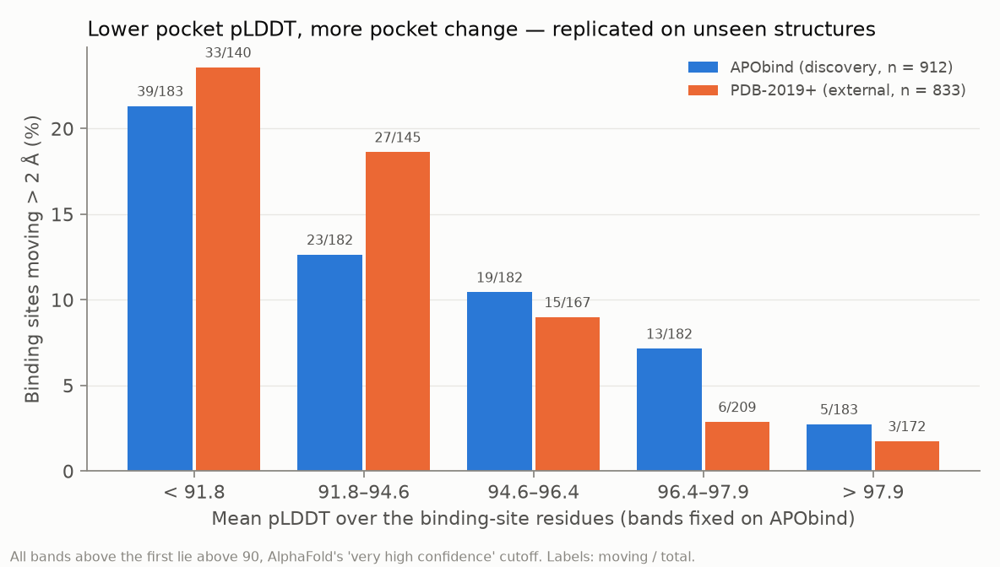

# flexflag

**Before you dock into an AlphaFold structure, check whether the pocket holds still.**
On 833 protein structures released *after* AlphaFold2's training cutoff, pockets in the
lowest fifth by **pocket pLDDT** reshaped by more than 2 Å between empty and
ligand-bound **14× as often** as pockets in the top fifth (24% vs 1.7%). The rule was
fixed on a separate dataset beforehand. **Whole-protein pLDDT, the usual check, is at
chance** (AUROC 0.44 vs 0.76).



> **Status: v0.1.1.** Datasets, labels, cluster-aware evaluation, the pLDDT baseline
> comparison, pre-declared external validation, pre-declared stress tests and the
> `flexflag check` CLI are done and reproducible (`bash scripts/rebuild_all.sh`). See
> [Status](#status) for what is scoped out.

## What this answers, and why

Docking screens molecules against one protein structure, increasingly an AlphaFold
prediction. Proteins flex, and binding pockets can reshape when a ligand binds.
AlphaFold returns one frame, and its confidence score (pLDDT) says how sure it is of
*that* frame, not whether the protein has others. Ensemble methods (MD,
AlphaFold2-RAVE, MSA subsampling) can sample other states but are expensive.
**flexflag is the cheap check in front of them:** is this pocket likely to change shape?
It flags risk. It does not predict the other conformation.

## Quickstart

```bash
pip install git+https://github.com/Dar-kSun/flexflag-v2  # Python ≥ 3.11
flexflag check Q9HWI0 --from-pdb 8evw          # pocket = residues near the ligand in 8EVW
flexflag check P69441 --residues 13,31,35-38   # or give pocket residues (UniProt numbering)
```

```
Q9HWI0  D-alanine--D-alanine ligase A  (346 residues)

Pocket: 30 residues (ATP in 8evw chain A)
Pocket mean pLDDT: 84.5   (whole protein: 89.3)

Pocket-change risk (> 2 Å, empty vs bound): HIGHEST
  band 1 of 5 by pocket pLDDT (< 91.8)
  observed in this band: 21% of 183 APObind pockets,
                         24% of 140 unseen PDB-2019+ pockets
  smoothed estimate: 22%  (base rate about 10%)

Why:
- Pocket pLDDT is in the lowest 40% of pockets studied. Even above 90 ('very
  high' in AlphaFold's usual reading), lower pocket pLDDT marks more change.
- 5 pocket residue(s) have pLDDT < 70.
- When pockets do move, the AlphaFold model resembled the bound (holo) state in
  69% of unseen cases. If you need the empty state, one
  AlphaFold structure is likely the wrong one.
...
```

This example's pocket does move (5.7 Å, 8EVW vs 8EVV). It comes from the evaluation
set, so it illustrates the method rather than being a new prediction. The tool also
misses cases: **adenylate kinase**, the textbook induced-fit enzyme, moves 6 Å but has a
confident pocket (pLDDT 94.7) and scores "moderate". Pocket pLDDT does not see rigid
domains closing over a well-predicted pocket.

`--from-pdb` checks that the PDB entry is actually of the given protein (≥ 90% sequence
match) and refuses otherwise. Without a pocket, `flexflag check <UniProt>` declines to
flag, because whole-protein pLDDT carries no signal (below).

## Results

Label: binding-site Cα RMSD between apo and holo after superposing the site; > 2 Å =
"large change" (other thresholds below). Two independent datasets:

| | Source | Proteins | Moving > 2 Å | Evaluation |
|---|---|---|---|---|
| **Discovery** | APObind (PDBbind v2019) | 912 | 99 (10.9%) | 5-fold CV grouped by 30%-identity clusters (669) |
| **External** | PDB-2019+ (built from RCSB + SIFTS) | 833 | 84 (10.1%) | Models frozen on discovery, applied unchanged |

Every holo structure in the external set was released after 2019-01-01, so after
AlphaFold2's training cutoff (2018-04-30) and after PDBbind v2019. All CIs are 95%
cluster bootstraps (clusters resampled, not proteins).

### 1. Whole-protein pLDDT does not predict pocket change

| AUROC, > 2 Å | Discovery (CV) | External (frozen) |
|---|---|---|
| Whole-protein mean pLDDT | 0.528 [0.472, 0.582] | **0.440** [0.377, 0.498] |

A high-confidence AlphaFold model is no less likely to have a pocket that reshapes.
This is the field's default heuristic, and it fails at every threshold tested. v0.1 also
tried richer whole-protein features (PAE inter-domain blocks, sequence composition):
AUROC 0.574 in CV, a gain over pLDDT of +0.046 [−0.027, +0.124] that is **not
significant** at 2 Å, and mostly a protein-family proxy ([findings](docs/findings.md)).

### 2. pLDDT at the pocket does, and the result replicates on unseen structures

| Model (> 2 Å) | Discovery AUROC (CV) | External AUROC (frozen) | External AUPRC |
|---|---|---|---|
| Whole-protein mean pLDDT | 0.528 [0.472, 0.582] | 0.440 [0.377, 0.498] | 0.086 |
| **Pocket mean pLDDT** (one number) | **0.691** [0.633, 0.743] | **0.762** [0.713, 0.810] | 0.237 |
| Pocket model (pocket + whole-protein features, boosting) | 0.746 [0.686, 0.799] | 0.781 [0.721, 0.833] | 0.343 |
| *Confound reference: pocket size alone* | *0.607* | — | — |

- **External gain of pocket pLDDT over whole-protein pLDDT: +0.32 AUROC
  [+0.23, +0.42].**
- **The simple heuristic does most of the work.** The 29-feature pocket model adds
  +0.054 [−0.007, +0.114] in CV and its external CI overlaps the rule's. A protein
  language model adds nothing (Section 4). So the CLI ships the one-number rule.
- **The hardest test:** 485 external proteins with **no** discovery protein in the same
  30% sequence cluster. Pocket pLDDT scores AUROC **0.704** [0.634, 0.773];
  whole-protein pLDDT scores 0.483.
- **Calibration:** the frozen rule's external ECE is 0.047. Band rates are reported
  directly rather than relying on the fitted curve.

Risk by pocket-pLDDT band (edges fixed on the discovery set; the figure above):

| Pocket pLDDT | Discovery: moving > 2 Å | External: moving > 2 Å |
|---|---|---|
| < 91.8 | 21.3% (39/183) | 23.6% (33/140) |
| 91.8–94.6 | 12.6% (23/182) | 18.6% (27/145) |
| 94.6–96.4 | 10.4% (19/182) | 9.0% (15/167) |
| 96.4–97.9 | 7.1% (13/182) | 2.9% (6/209) |
| > 97.9 | 2.7% (5/183) | 1.7% (3/172) |

Nearly all these pockets are "very high confidence" by the usual reading of pLDDT (> 90).
**Within that range, the exact value still matters.**

Threshold sensitivity, external set (frozen):

| Threshold | Positives | Whole-protein pLDDT | Pocket pLDDT |
|---|---|---|---|
| > 1 Å | 202 | 0.569 | 0.732 [0.695, 0.767] |
| > 1.5 Å | 122 | 0.434 | 0.754 [0.714, 0.798] |
| **> 2 Å** | 84 | 0.440 | **0.762** [0.713, 0.810] |
| > 3 Å | 35 | 0.449 | 0.706 [0.611, 0.780] |

### 3. When a pocket moves, AlphaFold usually hands you the bound shape, confidently

For each protein, the AlphaFold DB model's pocket was compared with both crystal
structures (same residues, site-superposed Cα RMSD):

| Moving pockets (> 2 Å) | n | AlphaFold closer to holo | Median AF–holo | Median AF–apo | Pocket pLDDT > 90 |
|---|---|---|---|---|---|
| Discovery | 99 | 80% | 0.60 Å | 2.48 Å | 71% |
| **External** (holo never seen by AlphaFold2) | 84 | **69%** | 0.92 Å | 2.54 Å | 69% |

AlphaFold's preference for the bound-like pocket holds on holo structures it cannot
have memorised. It is weaker there (69% vs 80%), so memorisation may explain part of
the discovery-set figure. It holds whether the apo structure is old (70%, n = 40) or
new (68%, n = 44). In practice: docking hits found in an AlphaFold pocket may look
better than the empty protein supports. If you need the empty or cryptic state, one
AlphaFold model is likely the wrong structure, and AlphaFold's confidence won't warn you.

### 4. Stress tests: trying to break the result

Each check was written down before it was run
([`plan-v0.4`](docs/plan-v0.4-robustness.md), [`plan-v0.5`](docs/plan-v0.5-overnight.md)).
Pocket-pLDDT AUROC at 2 Å, discovery / external:

| Check | Result | Verdict |
|---|---|---|
| Reference (true pocket, 5 Å) | 0.693 / 0.762 | — |
| **Shuffled labels** (200×) | 0.496 / 0.505 | Scoring is not leaking |
| **Same-size decoy patch** elsewhere on the protein (> 15 Å away) | 0.459 / 0.520 | **The signal is pocket-specific** |
| Pocket defined at 4 / 6 / 8 Å | 0.700–0.674 / 0.763–0.743 | Not sensitive to the cutoff |
| Pocket-size tertiles (small / medium / large) | 0.691 / 0.737 / 0.646 (discovery) | Not a pocket-size effect |
| Label: all-heavy-atom RMSD (side chains), matched positive rate | 0.691 / 0.727 | Holds |
| Label: whole-chain superposition | 0.690 / 0.761 | Holds |
| **Label test–retest** (a second, independent apo–holo pair) | κ = 0.20 / 0.44 between pairs; pocket pLDDT predicts the retest label at 0.688 / 0.775, vs 0.654 / 0.836 for the first pair's own RMSD | **Labels are noisy**; the rule tracks the protein about as well as a repeat measurement does |
| **Many ligands per protein** (apo fixed, up to 10 holos) | 88–89% of proteins with ≥ 3 ligands are consistent; "any ligand moves": 0.701 / 0.748 | Pocket change is mostly a property of the protein, not the ligand |
| **No ligand at all:** P2Rank pocket on the AlphaFold model (top-1) | 0.577 / 0.670; P2Rank's top pocket is the true one in ~65% | **Works, but weaker.** Best when you know your pocket |
| **Protein language model:** ESM-2 650M pocket embedding (+ pLDDT) | ESM alone 0.613 / 0.599; ESM + pLDDT vs pLDDT: +0.007 / **−0.065** [−0.131, −0.002] | ESM adds nothing and overfits families; the simple rule wins |

### How these analyses were kept honest

Every analysis after v0.1 was **written down and committed before it was run**:
pocket analysis `f66384c`, external validation `28757f6`, stress tests `6a83c01`,
overnight analyses `23038f4`. The git history shows each plan before its results.

Deviations, all after the plans were written:

- **A bug fix to the label code.** Inspecting the largest label (sirtuin-1, 13.9 Å)
  showed the ligand picker accepting non-standard residues *inside peptide chains*
  (a Fluor-de-Lys substrate peptide; statine in peptidomimetic inhibitors). That
  contradicts the documented definition. 22 discovery and 4 external labels were
  affected. After the fix (regression-tested), every dataset and result was rebuilt.
  Headline numbers barely moved (external 0.763 → 0.762), but the v0.1 whole-protein
  model's 2 Å gain dropped from significant to not significant. This README reports
  the rebuilt numbers.
- An added split of the AlphaFold-state analysis by release date.
- The ESM step was re-run after its first overnight attempt failed on a truncated
  model download.

## How the label is defined

For each apo–holo pair (`flexflag/labels.py`, tested in `tests/test_labels.py`):

1. Take the first model, drop hydrogens and waters, and keep the first altloc.
2. **Ligand:** the non-polymer, non-additive residue (≥ 6 heavy atoms) with the most
   heavy atoms within 5 Å of the protein. Buffers, glycans and ions are excluded.
   Peptide ligands, including modified residues of peptide chains, are out of scope.
3. **Pocket:** residues with any heavy atom within **5 Å** of the ligand.
4. Match apo and holo residues by sequence alignment (handles renumbering and chain
   renaming, which is tested).
5. **Label:** Cα RMSD of the pocket after superposing the pocket itself, so it measures
   deformation rather than whole-protein motion. Large change = > 2 Å.

Checks: adenylate kinase scores 6.1 Å and trypsin + benzamidine 0.16 Å.

**What the pocket features may use:** only the pocket's residue *positions*, as at
docking time. At docking you know where you are docking. In this evaluation those
positions come from the holo ligand. No holo coordinates, ligand identity, ligand size
or pocket size enter any feature. Pocket pLDDT is read from AlphaFold DB.
`tests/test_no_holo_leakage.py` checks that the whole-protein pipeline never reads a PDB
structure.

## Data

- **Discovery: [APObind](https://github.com/devalab/Apobind).** 12,267 pairs →
  quality filters (APObind TM-score ≥ 0.5, identity and coverage ≥ 0.9, crystal apo,
  same UniProt on both sides) → 1,183 proteins → 916 labelled → 912 with the pocket
  mapped onto AlphaFold. One pair per protein, so heavily studied proteins don't
  dominate.
- **External: PDB-2019+** (`scripts/05_external_dataset.py`). Holo: X-ray ≤ 2.5 Å, one
  protein entity, a ligand of ≥ 150 Da, released ≥ 2019-01-01 (40,469 entries that map
  to one UniProt in SIFTS). Apo: X-ray ≤ 2.5 Å, one protein entity, no non-polymer
  entities at all (16,821). Pairs need the same single UniProt and ≥ 90% overlapping
  UniProt ranges → 971 proteins → 833 labelled.
- Every dropped pair and protein is listed with its reason: `results/dropped.csv`,
  `results/external/dropped.csv`.
- Structures come from RCSB, UniProt mapping from SIFTS, and predictions and confidence
  from AlphaFold DB (v6 files).

## Reproduce

```bash
python -m venv .venv && .venv/bin/pip install -e ".[dev]"   # Windows: .venv\Scripts\
pytest                                   # 22 tests, offline, a few seconds
bash scripts/rebuild_all.sh              # every dataset and result, ~1 h with a warm cache
```

Individual steps, in order:

| Script | What it does |
|---|---|
| `00_feasibility.py` | 10 APObind pairs end to end, with timings |
| `01_build_dataset.py` | Discovery set (~15 min cold, ~1.3 GB cache in `data/cache/`) |
| `02_train_eval.py` | v0.1 whole-protein comparison (needs MMseqs2) |
| `03_pocket.py`, `04_pocket_model.py` | AlphaFold vs apo/holo at the pocket; pocket-level CV |
| `05_external_dataset.py`, `06_external_eval.py` | External PDB-2019+ set; frozen rule, band figure |
| `07_export_rule.py` | Writes `flexflag/rule.json` for the CLI |
| `08_robustness.py`, `09_retest.py` | Stress tests R1–R4; label test–retest |
| `10_p2rank.py` | Ligand-free mode (needs Java 17+ and P2Rank 2.5) |
| `11_esm_embed.py`, `12_esm_eval.py` | ESM-2 embeddings (GPU recommended; `pip install torch fair-esm`) and evaluation |
| `13_multipair.py` | Many ligands per protein |

`data/apobind_pairs.csv` (the APObind pair list) is committed. Regenerating it from
APObind's `apobind_all.csv` needs one manual browser download (see
[data-choice](docs/data-choice.md)). Results are deterministic (seed 0), and the
committed `results/` match the numbers above.

**Tools on Windows.** MMseqs2: unzip the `mmseqs-win64` release to a path without
spaces (default looked up: `%LOCALAPPDATA%\flexflag\mmseqs`), then run
`mmseqs\bin\busybox.exe --install <that bin folder>` once (hard links, no admin), or set
`FLEXFLAG_MMSEQS`. P2Rank: unpack P2Rank 2.5.1 and a Java 17+ runtime under
`%LOCALAPPDATA%\flexflag\`, or set `FLEXFLAG_P2RANK` / `FLEXFLAG_JAVA`. Long unattended
runs: `powershell -ExecutionPolicy Bypass -File scripts\overnight.ps1`.

## Limitations

- **Moderate discrimination.** AUROC 0.76 means a useful prior, not a verdict. Even in
  the riskiest band, three in four pockets do *not* move more than 2 Å.
- **Noisy ground truth.** Two independent apo–holo pairs of the same protein agree only
  moderately on the 2 Å label (κ = 0.20–0.44). Part of the remaining error is in the
  labels, and part is real ligand-to-ligand variation.
- **Misses confident domain closures.** Adenylate kinase is the example. Hinge motions
  that close rigid, well-predicted domains over a pocket are invisible to pLDDT.
- **The pocket must be supplied.** With P2Rank-predicted pockets and no ligand, AUROC
  drops to 0.58–0.67. A pocket that only forms on binding (cryptic) may be hard to
  specify.
- **Datasets.** Both lean toward well-studied, crystallisable drug targets (30–39%
  human). Viral polyproteins (no AlphaFold DB model), proteins over 1,500 residues and
  peptide ligands are excluded. The external set's "strict apo" rule (no ligands, ions
  or buffers at all) is conservative, and its holo ligands include cofactors.
- **The label is backbone-only (Cα).** It holds with an all-heavy-atom label, but
  side-chain rotamer changes inside a fixed backbone are not targeted.
- **Crystal artefacts.** Crystal packing, different constructs and resolution
  differences can create or hide apparent motion.
- **Clustering at 30% identity** is the standard but does not remove all remote
  homology.
- This repo flags risk. **It does not predict conformations, run docking, or make any
  claim about drug efficacy or clinical outcomes.**

## Status

**v0.1.1.** Done: both datasets, labels, cluster-aware CV with a leakage assertion,
pLDDT baselines, pocket-level analysis, pre-declared external validation, calibration,
threshold sensitivity, the stress tests in Section 4, and the CLI.

Next:

- **A docking test:** do flagged pockets actually make docking into the AlphaFold model
  fail more often? This is the most direct usefulness test, deliberately out of scope
  so far.
- Features aimed at hinge closures (the adenylate kinase failure mode).
- Better ligand-free pocket selection than P2Rank's top-1.
- Side-chain-specific labels.

## Citations

- Jumper et al. (2021). Highly accurate protein structure prediction with AlphaFold.
  *Nature* 596, 583–589.
- Varadi et al. (2024). AlphaFold Protein Structure Database in 2024. *Nucleic Acids
  Research* 52, D368–D375.
- Aggarwal, Gupta & Priyakumar (2021). APObind: a dataset of ligand unbound protein
  conformations for machine learning applications in de novo drug design. ICML 2021
  Workshop on Computational Biology; arXiv:2108.09926.
- Liu et al. (2017). Forging the basis for developing protein–ligand interaction
  scoring functions (PDBbind). *Accounts of Chemical Research* 50, 302–309.
- Dana et al. (2019). SIFTS: updated Structure Integration with Function, Taxonomy and
  Sequences resource. *Nucleic Acids Research* 47, D482–D489.
- Burley et al. (2023). RCSB Protein Data Bank (RCSB.org). *Nucleic Acids Research* 51,
  D488–D508.
- Steinegger & Söding (2017). MMseqs2 enables sensitive protein sequence searching for
  the analysis of massive data sets. *Nature Biotechnology* 35, 1026–1028.
- Krivák & Hoksza (2018). P2Rank: machine learning based tool for rapid and accurate
  prediction of ligand binding sites from protein structure. *Journal of
  Cheminformatics* 10, 39.
- Lin et al. (2023). Evolutionary-scale prediction of atomic-level protein structure
  with a language model (ESM-2). *Science* 379, 1123–1130.
- Vani, Aranganathan, Wang & Tiwary (2023). AlphaFold2-RAVE: from sequence to Boltzmann
  ranking. *Journal of Chemical Theory and Computation* 19, 4351–4354.
- del Alamo, Sala, Mchaourab & Meiler (2022). Sampling alternative conformational
  states of transporters and receptors with AlphaFold2. *eLife* 11, e75751.
- Buttenschoen, Morris & Deane (2024). PoseBusters: AI-based docking methods fail to
  generate physically valid poses or generalise to novel sequences. *Chemical Science*
  15, 3130–3139.

MIT licence. Built by Aryan Sinha (IIT Kharagpur).
